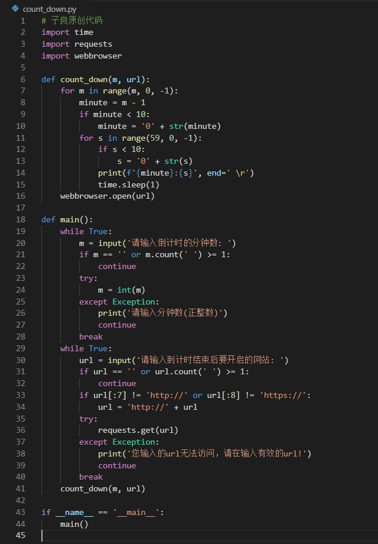
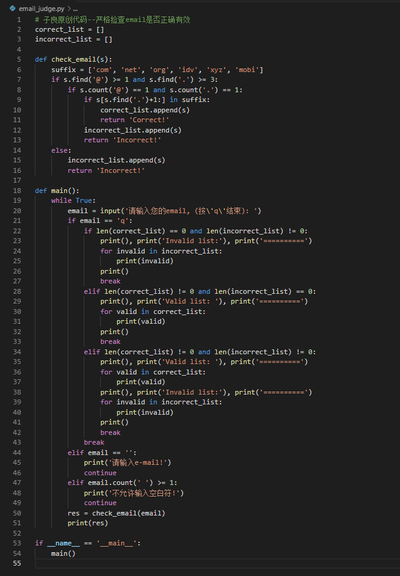

# 1，count_down.py/count_down.exe 说明
## 使用Python实现倒计时，到点后，开启某一个URL/do something
### 倒计时等基于时间的逻辑，都是排程软件的原型，这里我使用Python实现了一个从任一分钟开始倒计时到最后一秒后就立刻运行某一个功能，比如此例的开启某一个网站，这里会用到3个模块，其中也会用到爬虫常用的requests模块，用它来判断用户输入的是否是可以访问的web site或是无效的url(此例基于http与https)，此示例代码运行后，会询问用户两个问题：x分钟后，开启xxx网站，完整Demo的代码与运行结果，请见下图：

# 2，email_judge.py/email_judge.exe 说明
## 使用Python来严格判断email的正确性，不含国家/地区的后缀
### 我写了一个用来精确判断email是否是真正有效且合法的小工具，其中域名列表是用来比对的，只是一部份，可以随时添加和修改，该代码不判断比如xxx.com.hk等含后缀hk的域名，若有需要，可以再增加一个elif的判断条件就可以了，当然，还可以继续优化，比如添加用来检查email的dns回应码，都是可以的！

